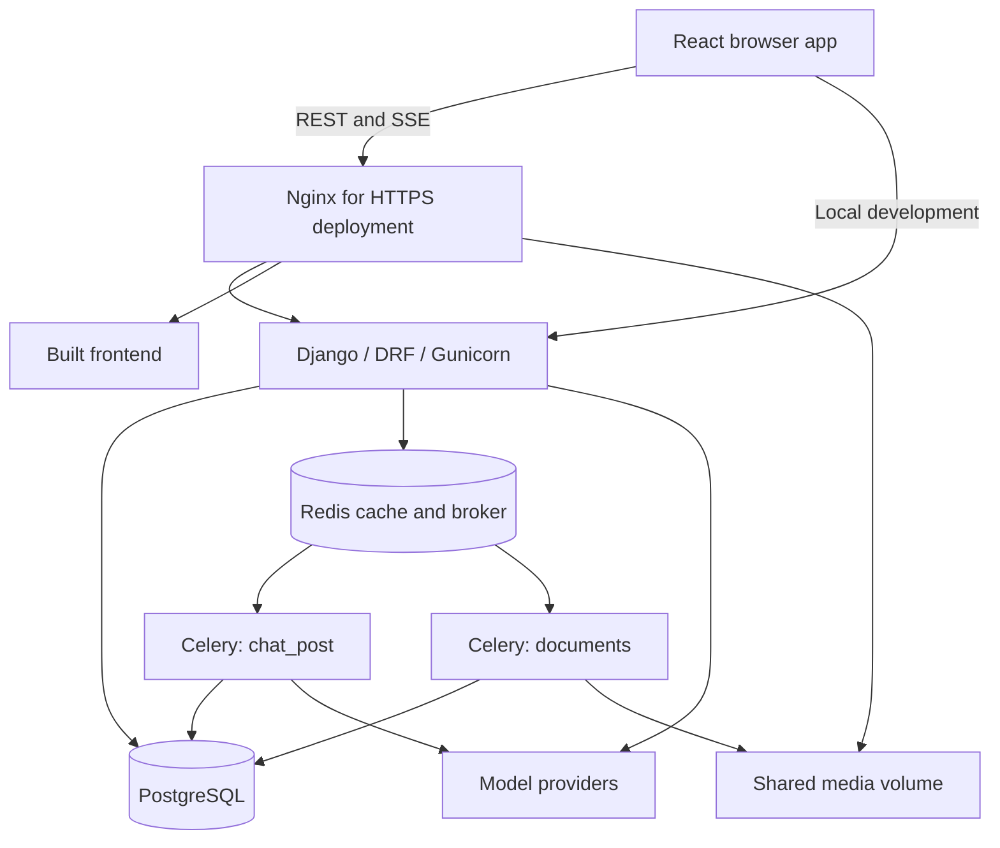

# METANIX — ConversationalAI-Gini

METANIX is a multi-model AI workspace with streaming chat, document questions and answers, presentation generation, response exports, file conversion, and an administration console. The repository and internal application names still use **Gini** in several places.

This guide covers development, daily use, configuration, deployment, operations, and security. It describes the checked-in implementation. Configuration examples are starting points, not a claim that a deployment is production-ready or security-certified.

Enterprise upgrade details, activation settings, cost changes, and validation results: [Enterprise upgrade](backend/ENTERPRISE_UPGRADE.md).

## Contents

- [Features](#features)
- [Architecture](#architecture)
- [Repository map](#repository-map)
- [Docker quick start](#docker-quick-start)
- [Host development](#host-development)
- [Using the workspace](#using-the-workspace)
- [Providers and configuration](#providers-and-configuration)
- [Authentication and SSO](#authentication-and-sso)
- [Conversation behavior](#conversation-behavior)
- [API reference](#api-reference)
- [Security](#security)
- [Production deployment](#production-deployment)
- [Operations and recovery](#operations-and-recovery)
- [Testing and contributing](#testing-and-contributing)
- [Troubleshooting](#troubleshooting)

## Features

| Area | Implemented behavior |
| --- | --- |
| Chat | Regular responses and server-sent event streaming with selectable providers |
| Modes | General, code, summarize, document, and presentation; UI labels may differ |
| Organization | Conversation history, search, custom names, projects, saved prompts |
| Context | Explicit context resets, configurable history, background summaries, and relevant stored user memory |
| Titles | Local title generation from the first question and a relevant response heading |
| Documents | PDF, DOCX, TXT, Markdown, CSV, and XLSX uploads by default; extracted text supplied to the model |
| Presentations | PPTX from model-produced slide JSON, themes, slide counts, optional configured image generation |
| Exports | Word, PDF, spreadsheet, CSV, and Markdown response exports; presentations have a separate workflow |
| Converter | Format combinations exposed by the converter API, background jobs, status and downloads |
| Administration | Users, providers, encrypted API keys, permissions, quotas, usage, and logs |
| Authentication | Local login and optional Microsoft Entra ID / Azure AD SSO |

Conversation attachments use extracted text in bounded prompt context. **Company Knowledge** mode uses permission-scoped pgvector retrieval from admin-uploaded documents. Scanned files need the queued PDF OCR tool before knowledge ingestion. Conversion fidelity depends on the source file, fonts, and installed libraries.

Optional live web search uses native provider tools and Tavily, with dated sources and separate quotas. It requires server credentials and a provider opt-in. Provider adapters do not imply that every vendor model supports the same features; validate live answers and citations with the configured model.

## Architecture



### Components

- **Frontend:** React 18, TypeScript, Vite, Tailwind, Radix UI, React Router, and Zustand. Exact versions are in `Frontend/package.json` and its lockfile.
- **Backend:** Django 4.2.17 and Django REST Framework 3.15.2 in `backend/requirements.txt`; the Docker image uses Python 3.11.
- **Web server:** Gunicorn with `gthread`. The supplied command uses 10 workers and 10 threads per worker. Chat views and SSE generators are synchronous. An ASGI module exists but is not the default server path.
- **Database:** PostgreSQL in Compose. SQLite is the settings fallback, but application migrations include PostgreSQL-specific extensions/indexes.
- **Redis:** Shared cache and Celery broker. Without `REDIS_URL`, cache falls back to process-local memory.
- **Workers:** Separate `chat_post` and `documents` queues, required for normal asynchronous workflows.
- **Nginx:** TLS termination, static frontend delivery, reverse proxying, and direct media delivery in the supplied HTTPS configuration.

### Chat lifecycle

1. The browser sends a JWT-authenticated question with provider and optional conversation/document identifiers.
2. The backend checks access/quota, stores the user message, and builds context.
3. A provider adapter sends the model request in the appropriate API format. Claude receives instructions in its top-level `system` field.
4. Regular chat returns JSON; streaming emits `token`, `done`, or `error` events.
5. Streaming saves the title before `done` and includes it in the event.
6. Streaming chat saves the completed assistant message before the completion event. The background chat task records usage and performs summary/memory processing. Document tasks extract or generate files.
7. The browser polls for persisted message/export state.

A completed stream does not prove background persistence has completed. A missing worker can leave a response visible in the browser but unavailable after reloading.

## Repository map

| Path | Purpose |
| --- | --- |
| `Frontend/src/components/chat/` | Window, sidebar, composer, artifacts, document UI |
| `Frontend/src/components/auth/` | Login and administration UI |
| `Frontend/src/hooks/` | Authentication and conversation stores |
| `Frontend/src/lib/api.ts` | REST, token refresh, SSE client |
| `Frontend/src/types/chat.ts` | API/domain types |
| `Frontend/vite.config.ts` | Development, preview, and build settings |
| `backend/accounts/` | Users, authentication, SSO, session/audit logging |
| `backend/admin_portal/llm_engine.py` | Provider adapters and prompts |
| `backend/admin_portal/llm_queue.py` | In-process admission controls |
| `backend/admin_portal/conversation_context.py` | Topic-scoped history and summaries |
| `backend/admin_portal/conversation_titles.py` | First-exchange titles |
| `backend/admin_portal/document_processor.py` | Text extraction |
| `backend/admin_portal/models.py` | Providers, chats, messages, documents, jobs |
| `backend/admin_portal/views.py` | API orchestration |
| `backend/admin_portal/tasks.py` | Celery tasks |
| `backend/admin_portal/services/` | Presentation, image, export, conversion services |
| `backend/admin_portal/management/commands/` | Provider seeding and title backfill |
| `backend/multimodel/` | Settings, routes, WSGI/ASGI, Celery setup |
| `nginx/` | HTTPS proxy and entrypoint |
| `docker-compose.yml` | Service definitions |

## Docker quick start

### 1. Prerequisites and environment files

Install Git and Docker with Compose support. On Windows, use Docker Desktop with Linux containers. Confirm `docker compose version` works. Run commands from the repository root unless noted otherwise.

Copy templates **only if the destination does not already exist**:

```powershell
Copy-Item backend/.env.example backend/.env
Copy-Item Frontend/.env.example Frontend/.env
```

On Linux/macOS, use `cp` instead. Do not overwrite configured environment files during updates.

### 2. Configure local development

Edit `backend/.env`:

```dotenv
SECRET_KEY=<unique-random-django-secret>
DEBUG=True
ALLOW_LOCAL_AUTH=True
AZURE_AD_ENABLED=False
ALLOWED_HOSTS=localhost,127.0.0.1,backend
CORS_ALLOWED_ORIGINS=http://localhost:5173
CSRF_TRUSTED_ORIGINS=http://localhost:5173,http://localhost:8000
ADMIN_USERNAME=<development-admin-name>
ADMIN_EMAIL=<development-admin-email>
ADMIN_PASSWORD=<unique-development-password>
ENCRYPTION_KEY=<generated-fernet-key>
```

Set `VITE_AZURE_AD_ENABLED=false` in `Frontend/.env` for local login. Generate secrets using an environment with Django and cryptography installed:

```bash
python -c "from django.core.management.utils import get_random_secret_key; print(get_random_secret_key())"
python -c "from cryptography.fernet import Fernet; print(Fernet.generate_key().decode())"
```

Store the output privately. Keep the encryption key stable while encrypted credentials exist.

**Compose precedence:** service `environment:` entries override `backend/.env`. `${DB_USER}`, `${DB_PASSWORD}`, and `${DB_NAME}` interpolation comes from the invoking shell or a root Compose `.env`, not automatically from `backend/.env`. Configure them consistently before initializing PostgreSQL. Updating initialization values does not reset credentials in an existing database volume.

### 3. Start services

Start named development services to avoid starting certificate-dependent Nginx accidentally:

```bash
docker compose up -d --build postgres redis backend celery-worker-chat celery-worker-documents frontend
docker compose ps
```

| Service | Development address |
| --- | --- |
| Frontend | http://localhost:5173 |
| API | http://localhost:8000/api/ |
| Health | http://localhost:8000/api/health/ |
| Django admin | http://localhost:8000/django-admin/ |
| PostgreSQL | localhost:5433; containers use `postgres:5432` |
| Redis | localhost:6379; containers use `redis:6379` |

Compose startup runs migrations, administrator creation, provider seeding, and development account setup. It creates/updates a fixed `devuser` superuser with a hard-coded development password. **Remove that bootstrap command and disable/remove the account before exposing production.** Startup resets its password, so changing the account alone is insufficient while bootstrap remains enabled.

### 4. Configure a usable provider

Sign in with the configured administrator, open Control center, configure a model endpoint and credentials, grant user model permissions, and set quotas. Seeded records do not guarantee working credentials.

Send a short message, reload the chat, and verify the response persists. Upload a small supported document to verify the documents worker separately.

### 5. Stop

```bash
docker compose stop
```

`docker compose down` removes containers/network. Do not add `-v` unless you intend to remove persistent volumes and their data.

## Host development

Prefer Python 3.11 to match the image and a Node version compatible with the locked Vite dependency. Compose uses Node 20. PostgreSQL and Redis are still needed for the normal application path.

```powershell
python -m venv venv
.\venv\Scripts\python.exe -m pip install -r backend/requirements.txt
```

Use `venv/bin/python` on Linux/macOS. Set host-accessible database/Redis addresses; `postgres` and `redis` are container DNS names. When using Compose PostgreSQL from the host, use port `5433`.

From `backend/`, using the virtual environment:

```bash
python manage.py migrate
python manage.py create_admin
python manage.py populate_llm_providers
python manage.py runserver 127.0.0.1:8000
```

Run separate worker terminals or keep workers in Linux containers:

```bash
celery -A multimodel worker -l info -c 8 -Q chat_post
celery -A multimodel worker -l info -c 4 -Q documents
```

From `Frontend/`:

```bash
npm ci
npm run dev
```

On PowerShell systems that block `npm.ps1`, use `npm.cmd` instead of weakening global execution policy.

The API client selects `http://localhost:8000/api` for origins containing `localhost`; otherwise it uses the page origin plus `/api`. It does **not** read Compose's `VITE_API_URL`. Adapt `getApiBaseUrl()` or proxy configuration for other topologies. Never place provider secrets in browser-visible `VITE_*` variables.

## Using the workspace

1. Sign in, select an allowed model, and start a chat.
2. Choose the relevant mode. Attach documents when the answer should use their contents, and wait for extraction.
3. Use presentation mode for slides, with optional theme/count. The request serializer accepts up to 30 slides; an unspecified count lets the model decide.
4. Use response export controls or supported export requests for downloadable files.
5. Organize chats into projects, reuse saved prompts, and rename chats manually if useful.
6. Use Converter for standalone conversion. The formats API defines supported combinations; not every extension converts to every other extension.

Administrators control model permissions, account activation, feature access, and time/cost quotas. Reconcile application usage estimates with provider billing.

## Providers and configuration

`LLMProvider` holds the name/slug, display name, adapter type, model identifier, endpoint, API version, generation settings, feature flags, prices, and credential configuration. Adapters cover Azure OpenAI, Azure AI Foundry, OpenAI, Gemini, Anthropic, Ollama, Hugging Face, and several OpenAI-compatible services. Inspect the registries in `llm_engine.py` for exact routing.

Use identifiers accepted by the configured endpoint. Configure `ENCRYPTION_KEY` before saving encrypted API keys and verify credentials after changing them. Environment-key fallbacks are also supported. Ollama outside the backend container needs a reachable address: container `localhost` points to that container.

Pricing includes input, cached input, and output rates per million tokens. Enter your contracted rates; the repository does not automatically maintain vendor prices or availability.

### Configuration reference

Defaults below are from source and can be overridden by `.env` or Compose.

| Variables | Meaning / source default |
| --- | --- |
| `SECRET_KEY` | Required Django secret; also signs application JWTs |
| `DEBUG` | `False`; enable only for isolated development |
| `ALLOWED_HOSTS` | Explicit backend hostnames |
| `DB_ENGINE`, `DB_NAME`, `DB_USER`, `DB_PASSWORD`, `DB_HOST`, `DB_PORT` | Database connection; Compose sets PostgreSQL explicitly |
| `DB_CONN_MAX_AGE` | `60` seconds of connection reuse |
| `REDIS_URL` | Shared cache; empty means process-local cache |
| `CELERY_BROKER_URL` | `redis://localhost:6379/0` |
| `CELERY_RESULT_BACKEND` | `django-db` |
| `ENCRYPTION_KEY` | Fernet key for stored provider credentials |
| `BACKEND_PUBLIC_URL` | Optional origin prefixed to generated media links |
| `ADMIN_USERNAME`, `ADMIN_EMAIL`, `ADMIN_PASSWORD` | Development administrator command inputs |
| `CORS_ALLOWED_ORIGINS`, `CSRF_TRUSTED_ORIGINS` | Explicit origins, including scheme and port |
| `SECURE_SSL_REDIRECT` | Defaults to `True` in production security settings |
| `THROTTLE_ANON`, `THROTTLE_USER` | `20/minute`, `120/minute` |
| `THROTTLE_DOCUMENT_CONVERSION` | `5/minute` on scoped upload/conversion routes |
| `DEFAULT_PAGE_SIZE` | `50`; some endpoints use separate limits |
| `MAX_UPLOAD_SIZE_MB` | `25`; align frontend and Nginx body-size limits |
| `ALLOWED_UPLOAD_TYPES` | `pdf,docx,txt,md,csv,xlsx` |
| `QUEUE_CONCURRENCY` | `5` per process; nonpositive disables the corresponding limit |
| `QUEUE_MAX_SIZE` | `100`; `0` permits an unbounded queue |
| `STREAM_TIMEOUT_SECONDS` | `300`; proxy/server/provider timeouts also apply |
| `CHAT_CONTEXT_MAX_MESSAGES` | `24` recent verbatim messages; per-provider overrides supported |
| `CHAT_CONTEXT_TOKEN_BUDGET` | Approximately `12000` tokens of recent verbatim history; higher input costs are possible |

Queued calls and streams use separate in-process mechanisms. They are not a single deployment-wide provider rate limiter. Account for all Gunicorn workers when sizing capacity.

Additional groups:

- Local access: `ALLOW_LOCAL_AUTH`, `AZURE_AD_ALLOW_LOCAL_ADMIN`.
- SSO: `AZURE_AD_ENABLED`, `AZURE_AD_TENANT_ID`, `AZURE_AD_CLIENT_ID`, `AZURE_AD_CLIENT_SECRET`, `AZURE_AD_REDIRECT_URI`, `AZURE_AD_FRONTEND_REDIRECT_URI`, `AZURE_AD_LOGOUT_REDIRECT_URI`, `AZURE_AD_SCOPES`, `AZURE_AD_AUTO_PROVISION`.
- Directory synchronization: `AZURE_AD_GRAPH_ENABLED`, `AZURE_AD_GRAPH_SCOPES`.
- Provider fallbacks: `OPENAI_API_KEY`, `CLAUDE_API_KEY`, `GEMINI_API_KEY`, `HUGGINGFACE_API_KEY`, and Azure OpenAI key/endpoint/deployment/version variables.
- Local models: `OLLAMA_BASE_URL`, `OLLAMA_MODEL`.
- Frontend SSO button: `VITE_AZURE_AD_ENABLED`; backend flags enforce availability.

See [backend/.env.example](backend/.env.example) and [settings.py](backend/multimodel/settings.py). Never paste actual environment files into tickets.

## Authentication and SSO

Local login returns access and refresh tokens. The browser sends `Authorization: Bearer <access-token>` and attempts refresh after an authorization failure. Source settings specify a 30-minute access token, a one-day refresh token, refresh rotation, and blacklisting of the previous refresh token.

For Entra ID / Azure AD:

1. Register the application in the intended tenant and configure approved callback/logout URIs.
2. Populate backend tenant/client configuration and enable SSO.
3. Enable the frontend button and rebuild/restart the frontend as appropriate.
4. Route backend `/auth/microsoft/login/callback/` separately from frontend `/auth/callback`.
5. Verify sign-in, rejected state/nonce mismatches, logout, and the intended provisioning policy.

The implementation includes state, PKCE, and ID-token issuer/audience/nonce validation. Graph integration is separately configured. SSO does not automatically enforce MFA or corporate conditional access; configure those at the identity provider.

## Conversation behavior

### Response policy and context

The shared policy asks the model to match the task, avoid boilerplate, state uncertainty, and avoid claiming unavailable capabilities. It also applies when database prompts override defaults. Specialized contracts such as presentation JSON remain in effect.

Only explicit reset phrases start a new context scope. Topic drift and language changes retain history. Optional semantic context retrieval can recall relevant earlier exchanges; relevant durable memory is available proactively. Company Knowledge uses newly authorized evidence for each question.

Recent history is bounded by count and estimated tokens. System instructions, document text, and summary notes are outside that history budget. The latest input remains intact even when it exceeds the budget, so provider limits still apply.

Background summaries compress evicted messages, preserve recent verbatim history, and record the last message actually covered. They are historical context, not privileged system instructions. Topic changes during summarization invalidate old results. Summarization never deletes stored messages; older details may be unavailable until background work catches up.

Durable user memory is still extracted in background tasks. It is included in model context only for explicit recall requests such as “what do you remember about me.” Topic changes do not erase stored memory.

See [CONVERSATION_CONTEXT.md](backend/CONVERSATION_CONTEXT.md) for thresholds and limitations.

### Automatic titles

Titles use the first question, optionally preferring a relevant Markdown heading in the first response. A first message such as “hey” produces “Hey”; later substantive questions do not automatically replace it. Custom names are preserved.

Repair placeholder names in the **active database**:

```bash
docker compose exec backend python manage.py backfill_conversation_titles
```

This is repeatable and leaves empty chats unchanged. Host Python may target an unused SQLite database; use Docker exec for a Docker deployment.

## API reference

Most endpoints require JWT authentication. The `/api/admin/` prefix includes ordinary user workspace endpoints; administrative operations add authorization checks in their views.

| Route or group | Purpose |
| --- | --- |
| `/api/health/` | Basic process health, not dependency readiness |
| `/api/accounts/login/`, `logout/`, `session/`, `me/` | Account/login operations under `/api/accounts/` |
| `/api/accounts/azure/authorize/`, `azure/token/`, `azure/logout/` | SSO operations under `/api/accounts/` |
| `/api/token/refresh/` | Rotate application refresh token |
| `/api/admin/conversations/`, `conversations/<id>/` | Conversations |
| `/api/admin/projects/`, `saved-prompts/` | Organization |
| `/api/admin/chat/`, `chat/stream/`, `chat/retheme/` | Chat and presentation themes |
| `/api/admin/documents/upload/`, `documents/`, `documents/<id>/` | Upload/list/status |
| `/api/admin/messages/<id>/export/` | Explicit response export |
| `/api/admin/messages/<id>/pptx-status/` | Presentation status |
| `/api/admin/conversations/<id>/export-status/` | Export/persisted-message polling |
| `/api/admin/llm-providers/`, `api-keys/` | Providers and credential administration |
| `/api/admin/users/`, `users/local/`, `users/<id>/permissions/` | User administration |
| `/api/admin/permissions/me/`, `usage/me/`, `stats/` | Current-user access/usage |
| `/api/admin/usage/admin/`, `usage/analytics/`, `dashboard/stats/` | Administrative analytics |
| `/api/admin/logs/sign-in/`, `logs/audit/`, `logs/llm/`, `logs/stats/` | Logs |
| `/api/admin/converter/access/`, `formats/`, `outputs/`, `convert/`, `history/` | Converter operations, all under `/api/admin/converter/` |
| `/api/admin/converter/<id>/status/`, `/api/admin/converter/<id>/download/`, `/api/admin/converter/<id>/` | Job status, download, deletion |

Where the table abbreviates a path, keep the base prefix of its group. For exact paths/methods, use [admin routes](backend/admin_portal/urls.py), [account routes](backend/accounts/urls.py), and [serializers](backend/admin_portal/serializers.py).

Example chat body:

```json
{
  "message": "Explain the uploaded document",
  "llm_provider": "your-configured-provider-slug",
  "chat_mode": "document",
  "document_ids": [123]
}
```

Add `conversation_id` to continue a chat. Document IDs must belong to the authenticated user. Provider selection also accepts `llm_provider_id`.

Streaming is an authenticated POST consumed with browser fetch, not an unauthenticated `EventSource` URL. Example SSE shapes:

```text
event: token
data: {"text":"Hello"}

event: done
data: {"conversation_id":42,"title":"Document overview","token_count":120,"export_format":null}

event: error
data: {"error":"The AI model failed to respond. Please try again."}
```

Fields vary by path; tolerate optional title/export fields. Check endpoint serializers for required inputs instead of inferring methods from names.

## Security

### Implemented controls and boundaries

| Area | Implementation | Boundary |
| --- | --- | --- |
| Authentication | Django password hashing, JWT, optional SSO | Browser compromise can expose persisted tokens |
| Authorization | Role/permission checks and owner-filtered workspace queries | UI visibility is not authorization; test new endpoints |
| Tokens | Access expiry and refresh rotation/blacklisting | These settings do not blacklist access tokens |
| Provider secrets | Fernet-encrypted database keys and masked display | Does not encrypt chats, documents, logs, disks, or backups |
| Transport | Nginx TLS; Django HTTPS/HSTS/cookie settings outside debug | Requires certificates and correct proxy configuration |
| Browser headers | CSP and other headers in Nginx frontend location | Coverage differs by location; verify API/media paths |
| Abuse controls | DRF throttles, upload limits, quotas, local admission controls | Not a WAF or deployment-wide denial-of-service defense |
| Audit | Sign-in, audit, and model usage records | No immutable/tamper-evident audit storage established here |
| Containers | Backend image switches to non-root | Mounts, network access, secrets, and other services still need review |
| Tasks | Celery accepts JSON | Broker access remains a sensitive trust boundary |

### Data exposure and privacy

Messages, extracted documents, summaries, and sometimes stored user memory are sent to the selected model provider. Presentation images may contact another configured provider. Review allowed data categories, provider retention settings, and organizational agreements before sending confidential content.

The frontend persists authentication state in browser storage. XSS or compromised extensions can expose tokens. Review content rendering, avoid unsafe HTML execution, maintain dependencies, and assess CSP changes.

**Direct media access:** supplied Nginx blocks direct access to company knowledge and conversion files; their download APIs enforce authorization. Other `/media/` paths are still served from the volume without application ownership checks. Someone who obtains a file URL may be able to retrieve it without signing in. Authenticated document APIs do not protect this separate route. Before handling confidential files, implement authenticated delivery or private storage with authorization-checked, short-lived links. Unpredictable filenames are not access control.

### Prompt, parser, and outbound-request risks

Prompts and topic detection improve behavior; they are not security boundaries. Documents and model output may contain malicious instructions. Validate machine-readable output, keep generated content separate from executable code, and do not execute model-generated scripts automatically.

The implementation does not establish comprehensive antivirus scanning, content-disarm processing, or a hardened sandbox for every parser. Limit formats and sizes, isolate heavy processing, and maintain parser dependencies.

Administrators configure provider endpoints, and image generation may download a provider-returned URL. No comprehensive destination allowlist is established here. Restrict administrative access and outbound network destinations to reduce server-side request forgery and exfiltration risk.

### Production security checklist

- Remove development account creation and hard-coded credentials from startup. Review existing privileged accounts.
- Use `DEBUG=False`, exact hosts/origins, valid certificates, correct SSO callbacks, and verified proxy trust.
- Protect Django/encryption keys, database/SSO/provider credentials with appropriate secret storage. Keep them out of Git, images, frontend bundles, and logs.
- Restrict PostgreSQL and Redis network access. Supplied Redis is not an authenticated, encrypted external service.
- Resolve direct media exposure before storing confidential files.
- Apply least privilege, realistic quotas, and identity-provider MFA/conditional access where required.
- Define retention/deletion for chats, memory, files, logs, task results, and backups. No complete automatic retention policy is configured here.
- Add dependency/image/secret scanning to CI. Lockfiles alone do not prove dependencies are vulnerability-free.
- Test TLS renewal, backup restoration, access revocation, cross-user isolation, and incident response.
- Assess compliance separately. This repository does not establish SOC 2, ISO 27001, GDPR, HIPAA, or other certification/compliance status.

### Rotation and incidents

Revoke exposed provider credentials at the provider, replace them in the application, verify access, and inspect usage. Removing a secret from Git is not revocation.

Changing `ENCRYPTION_KEY` alone makes existing ciphertext unreadable. No automatic multi-key rotation workflow is established here. Keep a protected old key, plan controlled re-encryption or credential re-entry, and test recovery before removal. The helper caches its key, so restart affected processes after changes.

Changing `SECRET_KEY` affects JWTs and other Django-signed data. Plan for session disruption. For account compromise, disable access as appropriate, revoke refresh credentials, investigate logs/provider usage, and consider remaining access-token lifetime.

Report vulnerabilities privately through your organization's security channel. Do not post credentials, private files, or exploitable production details publicly.

## Production deployment

Compose mixes development bootstrap with HTTPS deployment. Prepare a reviewed production configuration instead of exposing it unchanged.

1. Back up PostgreSQL, media, and protected configuration.
2. Replace development bootstrap with intended migration/release and server commands. Remove fixed-account creation and unnecessary provider reseeding.
3. Configure production storage, Redis, model credentials, origins, and access controls.
4. Set `DEBUG=False`. Supply `nginx/certs/fullchain.pem` and `privkey.pem`, or adapt certificate management. Set your own Nginx server name.
5. Build frontend assets and serve through Nginx, not the Vite development server.
6. Coordinate migrations, then start the web service and both worker queues.
7. Run static collection successfully. The Dockerfile tolerates build-time collection failure, so a built image alone does not prove static assets exist.
8. Verify authentication, streaming, persistence after refresh, uploads, conversion, downloads, and authorization through the real deployment path.

Relevant operations after preparing production configuration:

```bash
docker compose build backend
docker compose run --rm frontend-build
docker compose exec backend python manage.py migrate
docker compose exec backend python manage.py collectstatic --noinput
docker compose up -d celery-worker-chat celery-worker-documents nginx
```

Adapt startup depending on whether backend is already running. Rebuild after dependency changes. Bind-mounted code changes still require Gunicorn/Celery reloads; frontend hot reload differs from production builds.

Review timeouts together: supplied Nginx read timeout and Gunicorn command use 150 seconds; provider requests and stream settings have their own limits. Raising one does not extend the whole path. The SSE location disables buffering, caching, and compression; an isolated Nginx streaming check passes. Repeat through the complete production ingress route.

## Operations and recovery

### Monitoring

```bash
docker compose ps
docker compose logs --tail=100 backend celery-worker-chat celery-worker-documents
docker compose exec backend python manage.py showmigrations
docker compose exec backend python manage.py check
```

Health returns a basic status, not database/broker/worker/provider readiness. Monitor these separately, plus latency, 429/5xx rates, backlog, file failures, disk usage, and unexpected spending.

Tasks use `chat_post` and `documents`. Supplied workers do not consume the default queue. Route new tasks explicitly or provide a worker for their queue.

Avoid logging prompt/document contents, authorization headers, or decrypted keys. Audit/task records can contain sensitive context; restrict access and establish retention.

### Backups and restore

Back up PostgreSQL and `backend_media`, with necessary configuration and the encryption key protected separately. Redis persistence is not a database backup.

Use a custom-format PostgreSQL dump without binary redirection through PowerShell:

```bash
docker compose exec -T postgres sh -c 'pg_dump -U "$POSTGRES_USER" -d "$POSTGRES_DB" -Fc -f /tmp/metanix.dump'
docker compose cp postgres:/tmp/metanix.dump ./metanix.dump
```

Move dumps to protected backup storage and remove temporary copies under your retention policy. Include uploaded/generated media: database dumps do not contain file bytes.

Practice restoring into an isolated database and media volume. Verify counts, file availability, authentication, and credential decryption using the restored key. Stop writes or use a consistent snapshot strategy for coordinated backups. Never restore over live data without an explicit maintenance plan.

### Releases and rollback

Record revision, dependency locks, migration state, and configuration version. Test before switching traffic. Restart web and workers together when task signatures change.

Code rollback does not make schema rollback safe. Check migration reversibility or restore tested backups when necessary. Keep backups independent of container lifecycle.

## Testing and contributing

### Backend

From the root on Windows:

```powershell
.\venv\Scripts\python.exe backend/manage.py test admin_portal.test_conversation_titles admin_portal.test_conversation_context admin_portal.tests --settings=multimodel.test_context_settings
```

Isolated settings use SQLite in memory, local cache, fast password hashing, and no application-model migrations. **Never deploy a server with these settings.** They do not validate PostgreSQL migrations or real providers.

For PostgreSQL-backed tests, use normal Django test settings against a disposable environment with test-database permissions. Check schema and deployment configuration separately from `backend/`:

```bash
python manage.py makemigrations --check --dry-run
python manage.py check --deploy
```

Use intended production settings for deployment checks and investigate warnings.

### Frontend

From `Frontend/`:

```bash
npm ci
npm run build
npm run lint
npx tsc --noEmit -p tsconfig.app.json
```

A production build does not replace type checks or browser tests. See [METANIX_QA.md](Frontend/METANIX_QA.md) for the manual QA guide.

### Contribution rules

- Keep scope focused and preserve unrelated work.
- Add migrations for model changes; avoid casually editing applied migrations.
- Test regular and streaming paths for provider changes.
- Test cross-user access, quotas, and custom-name preservation when relevant.
- Update documentation and environment templates for new settings.
- Exclude credentials, certificates, dumps, logs, and media from commits. `.gitignore` cannot remove previously tracked secrets.
- State validation performed and remaining limitations in review descriptions.

## Troubleshooting

| Symptom | Checks and action |
| --- | --- |
| Chat still named New Chat | Backfill inside the active container, reload backend after code changes, refresh browser. Empty chats remain unnamed. |
| Title is Hey | First-exchange naming is intentional; rename manually for another topic. |
| Response disappears after refresh | Check `chat_post` worker and broker; stream completion precedes persistence. |
| Extraction/export stays processing | Check `documents` worker, task errors, media permissions, dependencies. |
| Host command reports no such table | Likely an unused SQLite database; use Docker exec for the active deployment. |
| Missing context timestamp column | Apply `0036_conversation_context` in the active database and reload workers. |
| 401 response | Check token expiry/rotation, account status, frontend refresh handling. |
| CORS failure | Match exact origin/scheme/port and the API client's destination selection. |
| Redirect loop / local health failure | Review debug/HTTPS settings, proxy headers, and HTTP health requests under production redirects. |
| SSO callback displays JSON | `/auth/callback` must load the SPA; `/auth/microsoft/` routes to Django. |
| Key decryption failure | Recover the correct encryption key or re-enter credentials in a controlled process. |
| Model missing or permission denied | Check activation/kind, user permissions, feature flags, and quotas. |
| Provider 429 / timeout | Inspect endpoint/model, vendor limits, worker count, queue settings, and timeout layers. |
| Tokens arrive in one batch | Check proxy SSE buffering/compression. |
| Download 404 | Check shared media volume, URL origin, proxy route, and job completion. |
| Empty PDF extraction | Confirm text exists; scanned pages may need an additional OCR workflow. |
| Nginx startup failure | Check certificates, configuration, frontend build, and backend health. |
| PowerShell blocks npm | Use `npm.cmd` without weakening global policy. |
| PostgreSQL rejects changed password | Existing volumes retain credentials; environment changes do not alter initialized users. |

For diagnosis, record endpoint, approximate time, conversation/job ID, provider, and redacted error. State whether running on the host, in Docker development, or behind Nginx. Never include raw tokens or full environment files.
